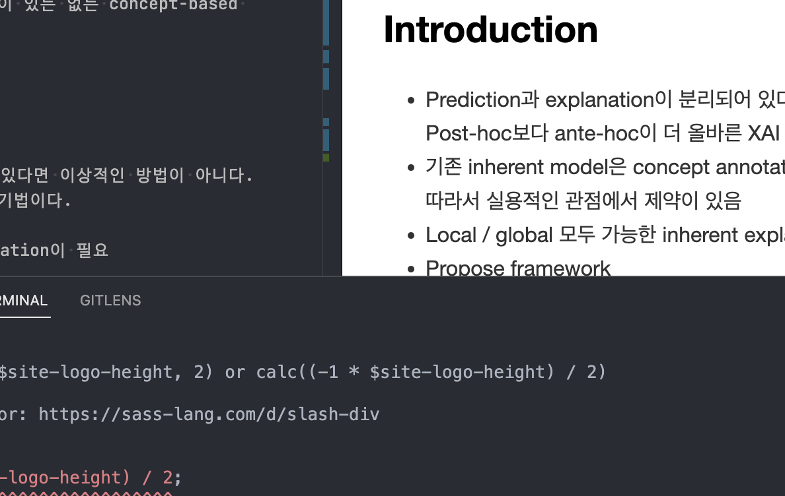

## Abstract
Concept 기반으로 설명하고 prediction score도 우수한 framework를 제안한다.

Contributions
- 주어진 dataset에 concept annotation이 있든 없든 concept-based explanation 가능
- 기존 baseline 모델보다 성능도 우수

## Introduction

- Prediction과 explanation이 분리되어 있다면 이상적인 방법이 아니다.
Post-hoc보다 ante-hoc이 더 올바른 XAI 기법이다.

- 기존 inherent model은 concept annotation이 필요
따라서 실용적인 관점에서 제약이 있음

- Local / global 모두 가능한 inherent explanation model이 없다

- Propose framework
	- 기존 CNN encoder를 그대로 사용 가능 
	- 단일 sample, 혹은 group of sample에 대한 설명 제공
	- concept level supervision이 있든 없든 concept-based 설명 가능
	- Accuracy와 explainability 모두 확보

## Method
![[Pasted image 20230131112433.png|800]]
$\mathcal X=\mathbb{R}^d$ : input space 
$\mathcal Y=\{ y \in \{0,1\}^M, \sum\limits^{M}_{j=1} y^j=1\}$ : output space(y is one-hot) M is number of classes, 
$\mathcal D=\{x_i, y_i\}^N_{i=1}$ 
$f_\theta=\{\eta_{\theta_e}(.),g_{\theta_c}(.)\}$ : prediction network
$\eta_{\theta_e}(.)$ : encoder , $g_{\theta_c}(.)$ : classifier 
$z_i=\eta_{\theta_e}(x_i)$ : encoded latent 
$\hat y_i=f_\theta(x_i)$ minimizing $\mathcal L_C(\hat y_i, y_i)$
$\psi_i = \Psi_{\theta_{ec}}(z_i)$ : encoded latent를 input으로 받아 concept을 뽑는 concept module 
$\hat x_i=h_{\theta_d}(\psi_i)$ minimizing $\mathcal L_R(\hat x_i, x_i)$ 
$\breve y_i=s_{\theta_{cce}}(\psi_i)$ latent으로든, concept으로든 예측할 때 차이가 없어야 한다.(informative)

- Loss function
$$\mathcal L_O=\mathcal L_C(y_i,\hat y_i)+\alpha\mathcal L_R(x_i, \hat x_i)+\beta\mathcal L_F(\hat y_i,\breve y_i)$$

여기서 $\mathcal L_R$은 $L_2$ loss,

-  Concept supervision이 있을 때 
$a_{x_i}$ = concept annotation
$\mathcal L=\mathcal L_O+\mu\mathcal L_E(\Psi_{\theta_{ec}}(z_i),a_{x_i})$

- Concept supervision이 없을 때 
$r_i$ = rotation target
$\mathcal L=\mathcal L_O+\mathcal \gamma L_{SS}(\zeta_{\theta_{ss}}(\Psi_{\theta_{ec}}(z_i)),r_i)$

Base encoder에서 뽑은 latent로 concept을 뽑고, 그 concept으로 이미지를 복원도 하고 prediction도 한다. 단, concept으로 prediction을 한 경우 latent로 prediction을 하는 경우와 동일해야 한다.

## 4. Experiment
- Architecture details
Encoder : ResNet18 encoder
Concept module : 1 FC layer
Decoder : Deconv layers

- Complexity
SENN보다는 60% 이하의 complexity
CBM보다는 150% 이하의 coplexity

- Concept activation visualization
학습된 concept들이 어떤 sample에서 크게 activate 되는가?
![[Pasted image 20230131112708.png|800]]
- Predictive performance ($\hat{y}, y$)
Concept supervision이 있던 없던 SENN, CBM보다 우수한 성능을 보인다.
![[Pasted image 20230131113145.png|500]]

- Faithfulness performance ($\breve{y}, y$)
학습한 concept으로의 prediction이 target label을 잘 예측하는가?
![[Pasted image 20230131113210.png|500]]

- Fidelity performance ($\breve{y}, \hat{y}$)
학습한 concept으로의 prediction이 충분히 backbone network의 prediction을 반영하는가?
![[Pasted image 20230131113103.png|500]]

- Explanation Error ($\Psi_{\theta_{ec}}(z_i),a_{x_i}$)
학습한 concept이 실제 concept annotation을 잘 반영하고 있는가?
![[Pasted image 20230131113310.png|500]]

- Self-supervised ablation study
Self-supervised가 정말 prediction에 도움을 주는 concept을 학습하는데 도움을 주는가?
![[Pasted image 20230131113419.png|500]]
Self-supervision이 network 전체에서 적용되는 것이 아니라, concept module의 추가 head로써 들어가기 때문에 faithful한 concept learning에만 영향을 준다고 주장하고 있다. 따라서 self-supervision을 추가했을 때 성능이 올라가는 것은 self-supervision이 network 전체 feature learning에 영향을 주어서 predictive performance가 상승한 것이 아니라, concept을 더 잘 학습했기 때문이라고 주장한다.

## 5. Conclusion

- 최소한의 parameter 추가로 기존 CNN backbone을 그대로 사용할 수 있고 
- Individual sample과 group of samples에 해당하는 concept-based explanation을 제공하며 
- Concept annotation이 있던 없던 concept을 학습할 수 있으며
- 기존 inherent explanation model보다 성능이 우수한

concept-based inherent explanation framework를 제안했다.