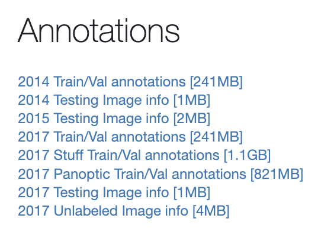

### 데이터 내려받기

https://cocodataset.org/#download 이 링크에서 COCO dataset을 다운받을 수 있다.

{: width="75%"}

`2017 Train/Val annotations`를 다운받아 어떻게 생겨먹었는지 탐색해보자. 바로 아래 `Stuff Train/Val annotations`는 중요해보이지 않는 물체들도 꼼꼼히 segmentation을 한 버전이라고 보면 된다.


```python
import json

anno_path = "annotations/instances_train2017.json"
with open(anno_path, 'r') as file:
    anno = json.load(file)

anno.keys()

# 출력 결과
# dict_keys(['info', 'license', 'images', 'annotations', 'categories'])
```

가장 상위 분류는 `info`, `license`, `images`, `annotations`, `categories`이다. 각자 하나씩 살펴보자.

**1. `anno['info']`를 출력**

```
{'description': 'COCO 2017 Dataset',
 'url': 'http://cocodataset.org',
 'version': '1.0',
 'year': 2017,
 'contributor': 'COCO Consortium',
 'date_created': '2017/09/01'}
```
정말로 해당 데이터셋 메타 데이터같은 정보들을 보여준다.

**2. `anno['license']`를 출력**

```
[{'url': 'http://creativecommons.org/licenses/by-nc-sa/2.0/',
  'id': 1,
  'name': 'Attribution-NonCommercial-ShareAlike License'},
 {'url': 'http://creativecommons.org/licenses/by-nc/2.0/',
  'id': 2,
  'name': 'Attribution-NonCommercial License'},
 {'url': 'http://creativecommons.org/licenses/by-nc-nd/2.0/',
  'id': 3,
  'name': 'Attribution-NonCommercial-NoDerivs License'},
 {'url': 'http://creativecommons.org/licenses/by/2.0/',
  'id': 4,
  'name': 'Attribution License'},
 {'url': 'http://creativecommons.org/licenses/by-sa/2.0/',
  'id': 5,
  'name': 'Attribution-ShareAlike License'},
 {'url': 'http://creativecommons.org/licenses/by-nd/2.0/',
  'id': 6,
  'name': 'Attribution-NoDerivs License'},
 {'url': 'http://flickr.com/commons/usage/',
  'id': 7,
  'name': 'No known copyright restrictions'},
 {'url': 'http://www.usa.gov/copyright.shtml',
  'id': 8,
  'name': 'United States Government Work'}]
```
워낙 방대한 이미지 데이터이다보니, 각 데이터가 수집된 경로가 다를 수 있고, 따라서 각 데이터마다 라이센스가 다르게 부여되어 있기 때문에 그것을 구분짓기 위한 정보다.

**3. `anno['images']`를 출력**

```
[{'license': 3,
  'file_name': '000000391895.jpg',
  'coco_url': 'http://images.cocodataset.org/train2017/000000391895.jpg',
  'height': 360,
  'width': 640,
  'date_captured': '2013-11-14 11:18:45',
  'flickr_url': 'http://farm9.staticflickr.com/8186/8119368305_4e622c8349_z.jpg',
  'id': 391895},
 {'license': 4,
  'file_name': '000000522418.jpg',
  'coco_url': 'http://images.cocodataset.org/train2017/000000522418.jpg',
  'height': 480,
  'width': 640,
  'date_captured': '2013-11-14 11:38:44',
  'flickr_url': 'http://farm1.staticflickr.com/1/127244861_ab0c0381e7_z.jpg',
  'id': 522418}, 
  ...
```
리스트에 각 이미지 한장 한장의 이미지에 대한 메타데이터를 담고 
있다. 따라서 리스트의 길이는 데이터 크기인 118287이다.

**4. `anno['annotations'][0]`을 출력**
```
{'segmentation': [[239.97,
   260.24,
   222.04,
   270.49,
   199.84,
   253.41,
   213.5,
   227.79,
   259.62,
   200.46,
   274.13,
   202.17,
   277.55,
   210.71,
   249.37,
   253.41,
   237.41,
   264.51,
   242.54,
   261.95,
   228.87,
   271.34]],
 'area': 2765.1486500000005,
 'iscrowd': 0,
 'image_id': 558840,
 'bbox': [199.84, 200.46, 77.71, 70.88],
 'category_id': 58,
 'id': 156}
```
`anno['images']`와 동일한 구조이지만 담긴 정보가 다르다. 이미지 인스턴스 한장만 살펴보면 segmentation을 하기 위한 꼭짓점들이 담겨있다. `area`의 경우 해당 segmentation 영역 넓이이다.
iscrowd는 물체가 다량 모여있는지 알려주는 정보다. bbox는 `[x,y,width,height]`로, 좌상단 꼭짓점의 좌표와 가로 세로 길이를 담고 있다. `category_id`는 클래스 id이고, `id`는 annotation된 object의 id이다. 한 이미지에 한 object만 annotation했다면 `image_id`와 `id`를 구분할 필요가 없었겠지만 그렇지 않기 때문에 구분할 필요가 있다.


**5. `anno['categories']`을 출력**
```
[{'supercategory': 'person', 'id': 1, 'name': 'person'},
 {'supercategory': 'vehicle', 'id': 2, 'name': 'bicycle'},
 {'supercategory': 'vehicle', 'id': 3, 'name': 'car'},
 {'supercategory': 'vehicle', 'id': 4, 'name': 'motorcycle'},
 {'supercategory': 'vehicle', 'id': 5, 'name': 'airplane'},
 {'supercategory': 'vehicle', 'id': 6, 'name': 'bus'},
 {'supercategory': 'vehicle', 'id': 7, 'name': 'train'},
 {'supercategory': 'vehicle', 'id': 8, 'name': 'truck'},
 {'supercategory': 'vehicle', 'id': 9, 'name': 'boat'},
 {'supercategory': 'outdoor', 'id': 10, 'name': 'traffic light'},
 {'supercategory': 'outdoor', 'id': 11, 'name': 'fire hydrant'},
 {'supercategory': 'outdoor', 'id': 13, 'name': 'stop sign'},
 {'supercategory': 'outdoor', 'id': 14, 'name': 'parking meter'},
 {'supercategory': 'outdoor', 'id': 15, 'name': 'bench'},
 {'supercategory': 'animal', 'id': 16, 'name': 'bird'},
 {'supercategory': 'animal', 'id': 17, 'name': 'cat'},
 {'supercategory': 'animal', 'id': 18, 'name': 'dog'},
 {'supercategory': 'animal', 'id': 19, 'name': 'horse'},
 ...
```
class label에 계층이 존재하며, 상위가 아니라 하위계층 기준으로 id를 설정한다. 총 80개의 class(`id`)가 존재한다.


