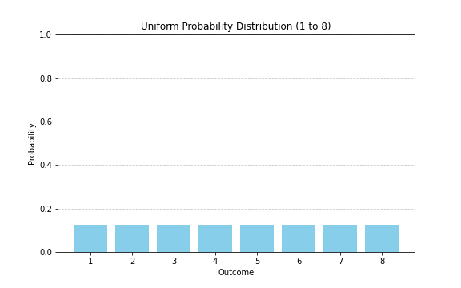
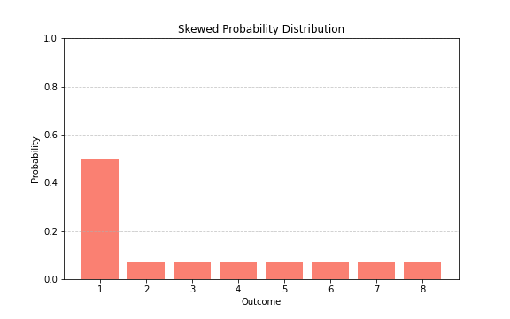
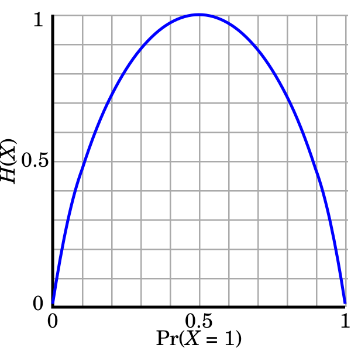

## 1. 정보량: '놀라움' 관점
특정 사건이 발생했을 때 놀라운 정도를 정보량이라고 정의하는 관점입니다.
공정하지 않은 6면 주사위를 예로 들었을 때, $P(X=1)=1/2$인데, $P(X=2)=1/32$라면 $2$가 발생할 확률이 훨씬 낮기 때문에 $1$보다 훨씬 놀라운 사건이라고 할 수 있습니다.

위 관점으로 정량적 측정을 위해 정보량 함수를 유도해보면,

- 희귀할수록 정보량이 크다.
사건이 자주 발생하면 별로 놀랍지도 않습니다. 드물게 일어나는 사건이어야 놀랍습니다.
따라서, 사건의 발생 확률이 낮을수록 정보량은 높습니다. 
특정 사건의 확률이 1에 가까울수록 정보량은 0에 가깝습니다.
특정 사건의 확률이 0에 가까울수록 정보량은 매우 커져야합니다.
따라서, 정보량은 $P(X)$와 역비례관계인 함수로 표현되어야 합니다.

$$
I(X) = f(\frac{1}{P(X)})
$$

- 독립적인 두 사건에서 얻는 총 정보량은 더해진다.
두 사건이 독립적이라면 두 사건이 함께 일어났을 때 정보량은 더해지는 것이 직관적입니다. 하지만, 독립적인 두 사건이 함께 일어날 확률은 각 사건의 확률을 곱해서 계산합니다. 따라서,

$$
I(A \space\space and \space\space B) = I(A)+I(B)
$$

- 위에서 계산한 두 식을 합치면, 

$$
f(\frac{1}{P(A)}\times \frac{1}{P(B)})=f(\frac{1}{P(A)})+f(\frac{1}{P(B)})
$$

확률과 정보량이 연속성을 만족한다고 가정하면, 해당 식은 아래 코시 함수 방정식 문제로 바꿀 수 있습니다.

$$
f(xy)=f(x)+f(y)
$$

위 코시 함수 방정식에 의해, 

$$
f(x)=log(x)
$$

 
해당 식을 위에서 얻은 역비례관계에 대입 후 정리하면

$$
I(X)=f(\frac{1}{P(X)})=log(\frac{1}{P(X)})=-log(P(X))
$$

결론적으로 정보량은 아래처럼 유도됩니다.

$$
I(X)=-log(P(X))
$$

## 2. 정보량: '불확실성' 관점
가치 높은 정보는 어떤 정보일지 생각해봅시다. 정보의 목적은 모르던 것을 알기 위함입니다. 하나의 정보로 많은 것을 알게 되면 그 정보는 가치가 높은 정보라고 할 수 있습니다.

1부터 8까지 숫자 중에서 상대방이 고른 숫자를 맞추는 게임을 한다고 합시다. 여기서는 상대방이 특정 숫자를 고를 확률이 모두 균등하게 $1/8$이라고 가정합니다. 가장 합리적인 질문 중 하나는,
>4보다 큰가요?

라고 시작하는 것입니다. 이진 탐색처럼 경우의 수를 절반씩 잘라내면서 질문하는게 가장 적은 질문으로 상대방이 고른 숫자를 맞추는 방법입니다. 상대방이 고른 숫자가 예를 들어 2이었다고 하면, 우리가 숫자 2를 맞추기 위해서는,
>4보다 큰가요? -> No (경우의 수: 1,2,3,4)
2보다 큰가요? -> No (경우의 수: 1,2)
1보다 큰가요? -> Yes (경우의 수: 2)

3번의 질문이 필요합니다. 해당 문제에서 어떤 숫자던지, (확률이 균등하다고 가정했으므로) 3번의 질문이 필요하고, 다시 말해, 정보가 3개 필요하고, 정보량이 3이라고 할 수 있습니다. 하나의 정보(질문)가 경우의 수를 절반씩 줄이기 때문에, 8개의 숫자에서 하나의 숫자를 찾을 때 필요한 정보의 갯수는

$$
I = log_2(8) = 3
$$

놀라움 관점에서 얻은 공식을 활용하면,

$$
I(X) = -log(P(X)) = -log(1/8)=-(-3)=3
$$

역시 정보량이 3으로 계산되는 것을 볼 수 있습니다.

놀라운 사건은 해당 사건 발생 후 우리에게 의미 있는 정보(많은 정보)를 주며,
불확실성이 높은 사건은 해당 사건에 대한 불확실성을 해소하기 위한 필요 정보가 많습니다.
따라서, **"특정 사건이 발생했다"에 담긴 정보량은 해당 사건 발생 여부를 알아내기 위해 필요한 정보량과 동일**하다고 볼 수 있습니다.

추가적으로, 위에서처럼 하나의 질문이 binary query의 형태인 경우,

$$
I(X)=-log_2(P(X))
$$

로그의 밑이 2가 되며, 자연스레 정보량의 단위는 bit가 됩니다.

아래에서 명시하지 않는 경우 로그의 밑은 2입니다.

## 3. Entropy
정보량이 한 사건의 불확실성에 집중한다면, Entropy는 시스템 전체의 불확실성을 다룹니다. 정보 관점에서 Entropy란 정보량의 기댓값입니다. 특정 사건이 아니라, 해당 사건이 속한 표본 공간 전체 사건의 확률 분포 상에서 정보량의 기댓값입니다. 

$$
H(X)=E[I(X)]=−∑ P(x)log(P(x))
$$

> 개인적으로 시스템 전체의 불확실성보다 한 사건의 불확실성을 이해하기 쉽게 설명하는 것이 더 어렵다고 생각합니다. 그래서인지 편의상 보통 정보량을 설명할 때 놀라움 관점으로 설명하는 경우가 많은 것 같습니다. 하지만 이 때문에 Entropy가 정보량의 기댓값이라는 정의가 직관적으로 무엇을 의미하는지 이해하기 어려운 경우가 많다고 봅니다. 정보량을 놀라움 관점으로 이해하는 것도 도움이 되나, 불확실성 관점에서 바라봐야 Entropy가 특정 확률 분포의 평균적인 불확실성임을 직관적으로 쉽게 이해할 수 있다고 생각합니다.

1부터 8까지 숫자 중 하나를 맞추는 게임을 다시 예로 들어봅시다. 역시 상대방이 각 숫자를 뽑을 확률은 모두 $1/8$로 균등한 uniform distribution을 이룬다고 하겠습니다. 이 때, 상대방이 뽑을 수 있는 숫자(1~8)에서 각 숫자를 맞추기 위해 필요한 정보량은 모두 $-log(1/8)=3$ 일테니, 1부터 8까지 범위의 정보량 기댓값 역시 $3$입니다. 따라서, 1부터 8까지 숫자 중 하나를 뽑을 때 엔트로피는 $3$입니다.

상대방이 숫자를 뽑을 확률 분포가 uniform distribution이 아닌 경우에는 어떨지 생각해봅시다. 예를 들어, 숫자 1을 뽑을 확률이 $50\%$이며 나머지 숫자를 뽑을 확률은 각각 $\frac{50}{7}\%$ 이라고 합시다. 이 경우에는 질문이 4보다 큰가요? 보다는 
> 1보다 큰가요?

가 되는게 합리적입니다. 이 때 실제로 뽑은 숫자가 1인 경우의 정보량을 계산해보면, 

$$
I(X=1)=-log(1/2)=1
$$

따라서, 숫자 1을 뽑을 확률이 $50\%$라면 한번만 질문하더라도 1인지 아닌지 알 수 있기 때문에 정보량이 1입니다.
이 때, 전체 사건에 해당하는 엔트로피를 계산해보면 1이 아닌 경우의 정보량은 모두 동일하므로,

$$
H(X)=−∑ P(x)log(P(x))
\\{}
\\=\frac{1}{2}I(X=1)+7\times\frac{1}{2\times7}I(X=2)
\\{}
\\=\frac{1}{2}-\frac{7}{2\times7}\times log(\frac{1}{2\times7})
\\{}
\\= 0.5 + 1.903...
=2.403...
$$

이제 여기서 물리학에서 사용되는 Entropy 개념이 왜 정보이론에서 차용되었는지를 엿볼 수 있습니다. 1부터 8까지의 숫자를 뽑을 확률 분포가 uniform distribution인 경우에는 Entorpy가 $3$이었으나, 확률 분포가 $1$로 치우쳐진 경우 $2.403$ 으로 낮아지는 것을 확인할 수 있습니다.

uniform distribution의 경우 확률 분포가 여러 곳에 퍼져 있습니다. 
skewed distiribution의 경우 확률 분포가 비교적 한 곳에 뭉쳐 있습니다.

무질서도 관점에서는 여러 곳에 퍼져있는 것보다 모여있는 것이 질서정연합니다.
불확실성 관점에서는 사건 발생을 예측할 때 여러 사건의 발생확률이 비슷한 것보다 하나의 발생확률이 높은 것이 예측 시 불확실성이 낮습니다.

아래는 binary entropy의 그래프로, 확률이 반반일수록, 엔트로피가 가장 높은 것을 확인할 수 있습니다.

높은 무질서도 = 수많은 경우의 수 = 높은 불확실성 = 정보의 부족 = 높은 엔트로피

## 4. CrossEntropy와 KL-Divergence
이전까지는 상대방이 1부터 8 사이 숫자를 고를 때, 어떤 확률 분포인지 모두 안다고 가정하고 논의를 진행했습니다. 하지만 여기서 다음 질문이 떠오를 수 있습니다.
> 상대방이 숫자를 고르는 확률 분포를 알지 못하는 경우라면?

사실 이런 경우가 더 현실성 있는 상황입니다. 상대방이 나에게 어떤 확률로 숫자를 뽑을지 알려줄리가 없기 때문입니다. 이때, 나는 상대방이 uniform distribution으로 숫자를 뽑는다고 가정하고, 실제로는 위 예시처럼 1번 숫자를 $50\%$ 확률로 뽑는 경우를 상정하겠습니다.

이때, uniform distribution을 $Q(X)$, 후자를 $P(X)$로 표시하면,
교차엔트로피는 다음과 같이 정의됩니다.

$$
H(P,Q)=−∑ P(x)log(Q(x))
$$

$P(X)$는 실제 분포를 의미하며 $Q(X)$는 실제 분포에 대한 나의 가정, 예측, 믿음을 의미합니다. 당연히 $Q(X)$가 $P(X)$와 유사할수록 엔트로피의 값이 낮아지며, 완전히 동일하면 일반 Entropy와 동일한 값을 가집니다. 이 말은, 나의 예측이 실제와 다른 만큼 CrossEntropy는 Entropy와 멀어진다는 의미이며, 나의 잘못된 예측으로 인해 발생하는 실제와의 괴리, 차이를 정의해보면, 

$$
H(P,Q)-H(P) = −∑ P(X)log(Q(X)) + ∑ P(x)log(P(X))
\\{}
\\= −∑ P(X)log(\frac{Q(X)}{P(X)})
\\{}
\\=D_{KL}(P||Q)
$$

해당 차이는 KLD(Kullback–Leibler divergence)로 불리며, 두 분포 간의 거리, 차이를 측정하는 도구로 사용됩니다. 실제 신경망 학습시에 $H(P)$가 상수이므로, CrossEntropy와 KLD 중 어떤 것을 loss function으로 사용하더라도 이론상 완벽히 동일한 학습 결과를 냅니다.
단, $H(P)$가 상수가 아닌 경우거나, **두 분포간의 차이**를 명시적으로 loss항에 추가해야하거나, 해석에 대한 지표로 사용하는 경우에는 의도적으로 KLD를 사용해야합니다.
