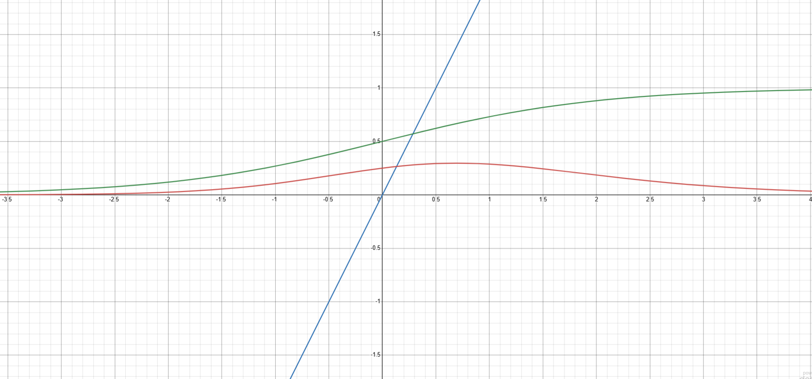
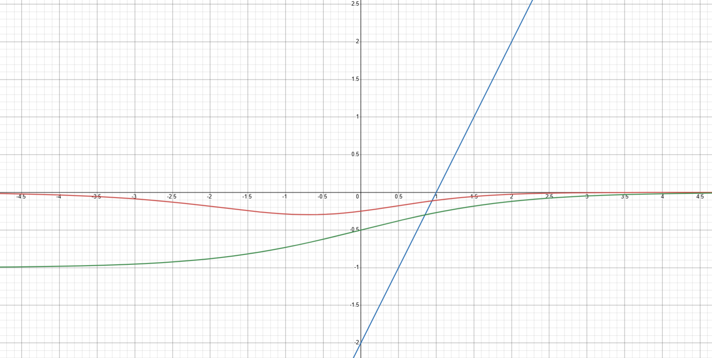

ML 기술 면접에서 "Logistic Regression의 Loss Function은 무엇인가요?"라는 질문을 받는다면, 대부분 "Binary Cross-Entropy (BCE)"라고 답변합니다. 꼬리 질문으로 "왜 Mean Squared Error(MSE)는 사용하지 않나요? MSE도 결국 예측값과 실제값의 차이를 줄이는 것 아닌가요?"라는 질문이 들어오면 어떨까요?
결론적으로 MSE는 Logistic regression같은 이진 분류에 적합하지 않은데, 그 이유를 수학적으로 파헤쳐보겠습니다.

## 1. Setup

먼저 노드의 갯수도 한개이며, 레이어도 한개인 경우인 아주 간단한 logistic regression을 셋팅해봅시다.

$z$: output value
$x$: input value
$w$: weight
$b$: bias
$\hat{y}$: sigmoid를 거친 출력 값
$\sigma$: sigmoid
$J(w)$: weight $w$에 대한 Loss

$$
z = w x + b
$$

$$
\hat{y} = \sigma(z) = \frac{1}{1 + e^{-z}}
$$

$$
J_{logi}(w) = (y - \hat{y})^2 = (y - \sigma(w x + b))^2 \text{ \# logistic regression with MSE loss}
$$

이진 분류 문제에서는 값을 0과 1로 맞추어야 하기 때문에 sigmoid가 필요하지만 선형 회귀에서는 sigmoid가 필요없습니다. 

## 2. MSE를 이진분류에 사용할 수 없는 이유
### 2.1 비볼록성 (Non-convex)

선형 회귀와 로지스틱 회귀의 유일한 차이가 sigmoid가 출력값에 포함되느냐 였습니다.
이 sigmoid의 존재가 Loss landscape를 non-convex하게 만들어 최적의 minimum을 찾기 어렵게 만듭니다. 따라서, non-convex한 loss landscape 때문에 MSE를 Logistic regression에 사용하기에 적합하지 않습니다.

실제로 볼록한지 아닌지를 살펴보기 위해, MSE를 사용한 3가지 케이스에 대한 Loss를 분석하겠습니다.

- logistic regression with MSE

$$
J_{logi}(w) = (y - \hat{y})^2 = (y - \sigma(w x + b))^2
$$

$$
\frac{\partial{J_{logi}}}{\partial{w}}= -2(y-\sigma(wx+b))\sigma(wx+b)(1-\sigma(wx+b))x
$$

- linear regression with MSE

$$
J_{line}(w) = (y - \hat{y})^2 = (y - (w x + b))^2
$$

$$
\frac{\partial{J_{line}}}{\partial{w}}= -2(y-(wx+b))
$$

- logistic regression with BCE

$$
J_{BCE}(w) = -ylog(\sigma(w x + b))-(1-y)log(1-\sigma(w x + b))
$$

$$
\frac{\partial{J_{BCE}}}{\partial{w}}= (\sigma(wx+b)-y)x
$$

실제 위 3개의 Loss를 $w$에 대한 derivative의 plot을 가로축이 $w$인 평면에 그려보면,
(편의 상 입력값 $x$를 1로, bias $b$를 0으로 설정)

- 정답인 $y$값이 0인 경우,

MSE를 사용한 logistic 회귀의 경우 기울기가 양수였다가 0.5와 1 사이에서 음수로 변하는 것을 보아 convex가 뒤바뀌는 것을 확인할 수 있습니다.

반면 나머지의 경우 모두 기울기가 양수로 일정한 것으로 보아, 일정하게 아래로 convex하여 optimizer가 최적점을 찾을 수 있음을 확인할 수 있습니다.

- 정답인 $y$값이 1인 경우,

정답 값이 1인 경우 역시 MSE를 사용한 logistic 회귀의 그래프는 기울기가 음수였다가 양수로 변하는 것을 보아 여전히 non-convex합니다.
반면에, 나머지의 경우 기울기가 일관되게 양수인 것으로 보아, 아래로 convex한 것을 알 수 있습니다.

결론적으로 sigmoid와 MSE를 섞어 쓰는 경우 loss landscape가 non-convex한 문제 때문에 optimizer가 학습 최적점을 찾기 어려운 문제로 인해 logistic regression에 MSE loss를 사용하지 않습니다.

### 2.2 잘못된 gradient penalty
이 부분이 조금 더 직관적이고 설득력 있고 중요합니다. MSE를 이진 분류에 사용하는 경우 우리가 원하는 학습 방향과 반대로 동작하게 되는 문제가 생깁니다.

$$
\frac{\partial J_{logi}}{\partial W} = -2(y - \sigma(z)) \cdot \underbrace{\sigma(z)(1-\sigma(z))}_{\text{sigmoid derivative}} \cdot x
$$

위 식에서 gradient에 포함되는 sigmoid derivative 항이 문제가 됩니다.

예를 들어, 예측하려는 정답 값이 $y=1$이라고 할 때, 출력 값인 $\sigma(z)\simeq0$ 이라고 합시다.
이 때, 예측이 완벽히 틀렸으므로 큰 gradient를 발생 시켜 더 강하게 학습하길 원합니다.
하지만, 출력 값인 $\sigma(z)\simeq0$가 되면 sigmoid derivative 항이 0에 가까워지게 됩니다. 다시 말해, 크게 틀린 경우임에도 불구하고 gradient penalty가 오히려 매우 약하게 동작하여 gradient vanishing이 발생한다고 의미입니다. 그렇다면, BCE를 사용한 경우엔 어떨까요?

$$
\frac{\partial J_{BCE}}{\partial W} = (\sigma(z) - y)x
$$

정답 값이 $y=1$인 경우 $\sigma(z)\simeq0$가 되면, gradient가 $-x$가 되고, $\sigma(z)\simeq1$ 이 되면 gradient가 0에 근접하여 우리가 원하는 방향대로 학습이 이루어지게 됩니다. 다시 말해, BCE loss를 logistic 회귀에 사용하면 크게 틀릴 수록 더 큰 gradient를 발생시키고, 정답에 가까울수록 작은 gradient를 발생시켜 학습이 이루어지도록 하는, 이상적인 학습의 모습과 일치합니다.

## 3. 결론
정리하자면, Logistic Regression의 손실 함수로 MSE를 사용하지 않는 이유는 다음과 같습니다.

- **Non-Convex 문제**: sigmoid와 MSE를 함께 쓰면 Non-convex 손실 함수를 만들어, Local Minima에 빠질 위험이 크고 최적해를 보장하기 어렵습니다.

- **잘못된 Gradient 페널티**: 모델이 자신 있게 틀린 예측을 할수록 gradient가 0에 가까워져 학습이 거의 이루어지지 않는 치명적인 모순이 발생합니다.
