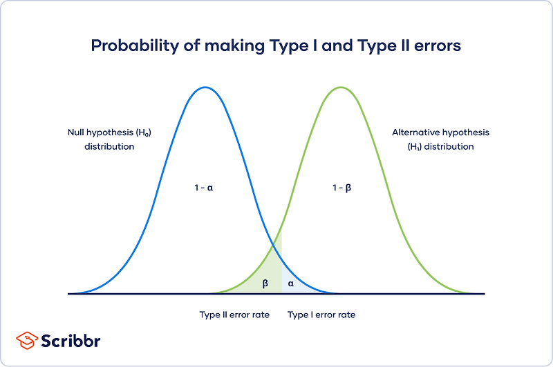

ML모델을 배포하기 전 A/B테스트를 수행할 때 너무 큰 표본으로 실험을 수행하면, 비용이 많이 들며 검증되지 않은 ML모델로 인해 불필요하게 많은 유저들에게 부정적인 경험을 제공할 위험이 있습니다. 그렇다고 너무 작은 표본크기로 실험을 수행하면 통계적 유의성을 만족하지 못 합니다. 따라서, 통계적 유의성을 만족하면서 최대한 작은 표본크기를 계산할 필요가 있습니다. 
이 글에서는 A/B테스트 시에 통계적으로 유의미한 최소 표본크기를 구하는 공식을 유도해보겠습니다.

## 1. 기본 설정 및 가정
- 두 개의 독립적인 그룹: 대조군($A$)와 실험군($B$)
- 실험목적: 실험군 $B$의 ML모델이 대조군 $A$의 ML모델보다 평균 앱 체류시간이 높은 것으로 관찰되었는데, 이 관찰이 통계적으로 유의미한지 확인
- 표본 크기: $n_A=n_B=n$
- 각 그룹의 데이터는 중심극한정리에 의하여 정규분포를 따를 정도로 클 것이라고 가정하고, 두 그룹을 잘 샘플링하여 분산은 $\sigma^2$로 동일하다고 가정
- $X_A∼\mathcal{N}(\mu_A, \sigma^2)$
- $X_B∼\mathcal{N}(\mu_B, \sigma^2)$
- 검정통계량(검사할 대상): $D=\hat{X_B}-\hat{X_A}$

중심극한정리에 의해, 검정통계량 $D$ 역시 정규분포를 따릅니다. 표본평균과 표본분산을

- 표본 평균: $E[D]=\mu_b-\mu_A$
- 표본 분산: $Var(D)=\mathrm{Var}(\hat{X_A})+\mathrm{Var}(\hat{X_B})=\frac{\sigma^2}{n}+\frac{\sigma^2}{n}$

## 2. 가설검정 셋팅
- $H_0$: A그룹과 B그룹의 평균 앱 체류시간은 차이가 없다. ($\mu_B-\mu_A=0$)

$$
D∼\mathcal{N}(0, \frac{\sigma^2}{n})
$$

- $H_1$: A그룹과 B그룹의 평균 앱 체류시간은 유의미하게 존재한다. ($\mu_B-\mu_A=\delta$)

$$
D∼\mathcal{N}(\delta, \frac{\sigma^2}{n})
$$

  $\delta$는 MDE(최소 감지 가능 효과)이며 유의미한 검정통계량(평균 앱 체류시간) 변화의 최소기준을 의미합니다.

두 가지 가정에서 모두 만족하는 하나의 임계값($D_{crit}$)을 찾고 그걸 기반으로 표본크기 $n$을 역산할 수 있습니다.

## 3. 제약 조건 

#### 조건 1. 유의수준
유의수준 $\alpha$는 1종오류($H_0$이 참인데 $H_0$를 기각)의 확률입니다. $H_0$가 기각되는 그 경계지점(p-value=$\alpha$)을 찾아야합니다.

A/B테스트를 수행할 때 우리가 관측한 결과가 우연히 발생한 것이 아니라 통계적으로 유의미한지 여부를 입증해야 합니다. 다시 말해, $H_0$가 참일 때 관측된 앱 체류시간 차이 $D$의 p-value가 유의수준 $\alpha$와 같은 그 지점 $D_{crit}$을 찾아야합니다.

$$
P(D>D_{crit}|H_0)=\alpha
$$

z값을 찾기 위해 정규화를 수행하면,

$$
P(\frac{D-0}{\sqrt{2\sigma^2/n}} > \frac{D_{crit}}{\sqrt{2\sigma^2/n}}) = \alpha
$$

$$
\frac{D_{crit}}{\sqrt{2\sigma^2/n}} = Z_{1-\alpha}
$$

$$
D_{crit}=Z_{1-\alpha}\sqrt\frac{2\sigma^2}{n} \space\space\space ⋯(식 1)
$$

#### 조건 2. 검정력
검정력($1-\beta$)은 우리가 관찰한 $H_1$를 제대로 받아들일 확률입니다. 따라서, $\beta$는 2종오류($H_0$이 거짓인데 $H_0$를 채택)의 확률입니다. 다시 말해, $H_1$가 참일 때 관측된 앱 체류시간의 차이 $D$의 p-value가 $1-\beta$와 같아지는 그 지점 $D_{crit}$을 찾아야 합니다.

$$
P(D > D_{crit}|H_0)=1-\beta
$$

$$
P(D \leq D_{crit}|H_0)=\beta
$$

z값을 찾기 위해 정규화를 수행하면,

$$
P(\frac{D-\delta}{\sqrt{2\sigma^2/n}} \leq \frac{D_{crit}-\delta}{\sqrt{2\sigma^2/n}}) = \beta
$$

$$
\frac{D_{crit}-\delta}{\sqrt{2\sigma^2/n}} = Z_{\beta}
$$

$$
D_{crit}=\delta+Z_{\beta}\sqrt\frac{2\sigma^2}{n} \space\space\space ⋯(식 2)
$$

## 4. 표본 크기 $n$ 계산

식1과 식2를 합치면,

$$
Z_{1-\alpha}\sqrt\frac{2\sigma^2}{n}=\delta+Z_{\beta}\sqrt\frac{2\sigma^2}{n}
$$

계산의 편의를 위해 $Z_{\beta}$를 $-Z_{1-\beta}$로 치환하면,

$$
(Z_{1-\alpha}+Z_{1-\beta})\sqrt\frac{2\sigma^2}{n}=\delta
$$

$$
(Z_{1-\alpha}+Z_{1-\beta})\sqrt\frac{2\sigma^2}{\delta^2}=\sqrt{n}
$$

$$
n=\frac{2(Z_{1-\alpha}+Z_{1-\beta})^2\sigma^2}{\delta^2}
$$

## 5. 식 분석
해당 식을 조금 더 직관적으로 이해해보겠습니다.

해당 식은 크게 $(Z_{1-\alpha}+Z_{1-\beta})$와 $\frac{\sigma}{\delta}$로 나눠볼 수 있습니다. 

#### 확신에는 비용이 든다.
$(Z_{1-\alpha}+Z_{1-\beta})$는 우리가 실험 결과에 대해 얼마나 높은 확신을 요구하는지를 의미합니다.
- $Z_{1-\alpha}$: 유의수준과 관련있습니다. 높을 수록, 요구 p-value가 낮아집니다. 다시말해, 1종오류를 범할 확률을 떨굽니다. 
- $Z_{1-\beta}$: 검정력과 관련있습니다. $H_1$이 사실일 때 채택할 확률이 올라갑니다. 다시 말해, 2종 오류를 범할 확률을 떨굽니다.

우리의 통계적 추정으로 관측된 $H_1$(B모델이 앱 체류시간을 늘렸다.)가 통계적으로 유의미한지 더 강하게 확실하게 입증하고 싶다면($Z_{1-\alpha}+Z_{1-\beta}$가 커진다면, 1종오류와 2종오류를 범할 확률을 떨구고 싶다면), 자연스레 더 큰 표본 크기가 필요합니다.

#### Signal vs. Noise
${\sigma}/{\delta}$를 살펴봅시다. $\delta$는 MDE(최소 탐지 가능 효과)였고, $\sigma$는 데이터의 분산과 관련이 있습니다. 예를 들어, 잡음이 매우 큰 비행기에서는 바로 옆사람과 대화하기 위해 꽤 큰 목소리로 말해야 합니다. 반대로, 도서관에서는 작은 목소리여도 멀리있는 사람과 대화가 됩니다. 
만약 $\sigma$를 noise로, $\delta$를 signal(목소리)의 세기라고 생각하면, 얼마나 멀리($n$) 있는 사람과 대화할 수 있는지 계산할 수 있습니다.

모집단의 분산이 크다면 그만큼 변동성이 크다는 의미이기 때문에 더 많은 표본이 필요합니다.
만약 MDE가 매우 작다면, 그 작은 효과를 통계적으로 입증하기 위해 굉장히 많은 표본이 필요합니다.

#### 바꿀 수 있는 것
$\sigma$는 모집단의 분산과 관련이 있으므로 바꿀 수 없습니다.
단, MDE($\delta$)와 유의수준($\alpha$)과 검정력($\beta$)는 실험을 하는 우리가 원하는 값으로 설정하는 것이기 때문에 바꿀 수 있습니다.

따라서 유도한 최소 표본 크기 공식은 **"이 정도의 확신$\alpha, \beta$으로 이 정도로 작은 차이$\delta$를 감지하려면, $n$ 만큼의 비용이 든다."**라는 의미를 갖게 됩니다.
