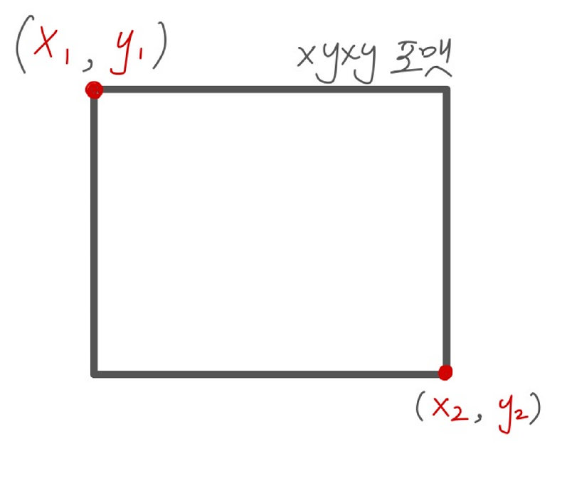
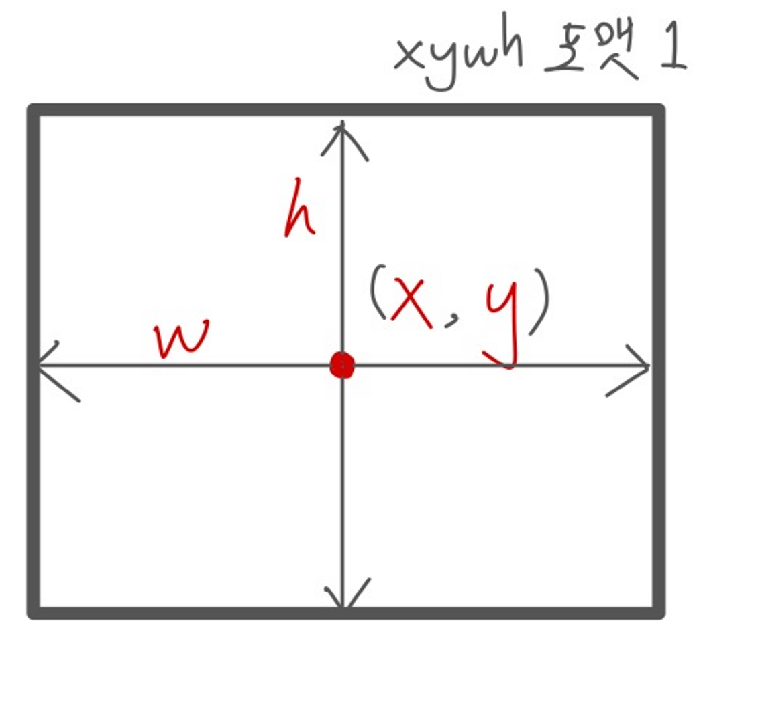
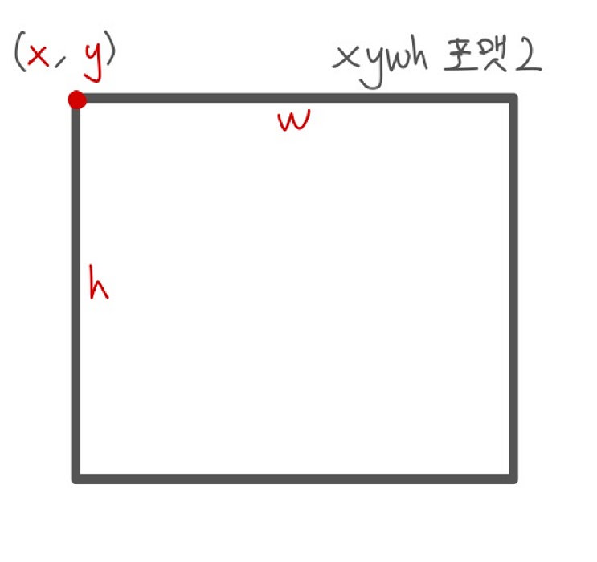

객체 탐지 프로젝트를 하다보면 xyxy와 xywh 두 포맷을 모두 사용해본 경험이 있을 겁니다. 보통, 선호하는 포맷을 정해놓고 그것만 쓰거나, 사용하는 프레임워크에서 주로 쓰는 포맷을 선택해 사용하지만, 두 방식 모두 올바른 사용방식이 있습니다. 두 포맷의 차이와 어떤 상황에서 써야하는지 알아보겠습니다.

## 1. 기본 개념 정의: 시각화 vs 기하학
이미지의 너비를 `W`, 높이를 `H`라고 가정합니다.  

`xyxy` 포맷: 좌상단과 우하단 점 (Top-Left, Bottom-Right)
정의: `[x_min, y_min, x_max, y_max]` or `[x1, y1, x2, y2]` 박스의 좌측 상단 꼭짓점과 우측 하단 꼭짓점
의미: "어디서부터 어디까지"를 표현. **시각화(Visualization)**에 매우 직관적
사용처: PASCAL VOC, KITTI, opencv (절대픽셀)

  

`xywh` 포맷1: 중심 좌표와 너비/높이 (center_x, center_y, Width, Height)
정의: `[xc, yc, w, h]` (박스 좌측 상단 꼭짓점과 박스의 가로세로)
의미: YOLO 모델 학습 시 모델이 bbox를 예측하는 방식과 관련
사용처: YOLO 포맷, ultralytics 프레임워크 학습 시 포맷 (정규화픽셀)
    

`xywh` 포맷2: 좌상단 점과 너비/높이 (x_min, y_min, Width, Height)
정의: `[x_min, y_min, w, h]` 박스의 좌측 상단 꼭짓점과 박스의 가로세로
의미: "어디서부터 얼마나 큰"지를 표현. **기하학적 속성(Geometric Properties)**에 대한 정보를 직접적으로 제공
사용처: COCO dataset(절대픽셀)

## 2. xyxy vs. xywh

### 1. opencv, PIL 호환성 (xyxy)
opencv나 PIL에서 xyxy를 사용하므로, 해당 라이브러리를 주로 사용한다면 xyxy가 편리합니다.

### 2. IoU, clipping 연산효율 (xyxy)
IoU를 계산하려면 `max(x_min), max(y_min), min(x_max), min(y_max)`를 알아야하는데, xyxy가 더 효율적입니다.
bbox가 이미지 경계를 벗어나는 경우 처리(clipping) 시에도 `x_min, y_min = max(0, x_min), min(H, y_max)`이런 식으로 훨씬 간단하게 연산이 가능합니다.

### 3. 기하학적 필터링 및 augmentation (xywh)
넓이가 100픽셀 이하인 bbox는 제거하고 싶다거나, 가로세로 비율이 2를 넘지 않는 경우만 남기고 싶은 등의 기하학적 성질을 활용하는 경우 xywh가 더 편리합니다.

### 4. YOLO 계열 학습 (xywh)
YOLO 모델의 설계 자체가 anchor box의 중점으로 부터의 offset과 가로세로를 예측하도록 설계가 되었기 때문에, YOLO 모델을 학습할 때는 xywh 포맷이 더 적합합니다.

## 추천 방식
1. 데이터 로딩, 전처리, augmentation은 xyxy 포맷 유지
2. 학습 시 xywh가 적합한 경우 학습할 때만 xywh로 변환
3. 후처리 상황이나 학습 이후 실제 제품에 적용할 때는 xyxy 포맷 사용
