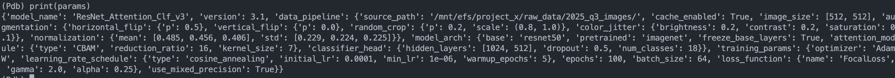
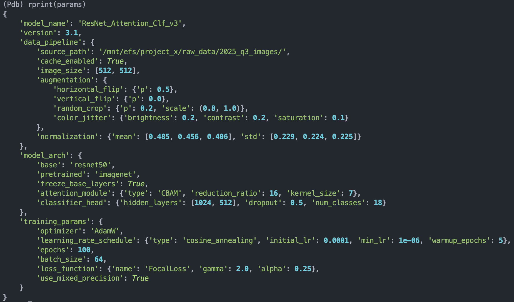
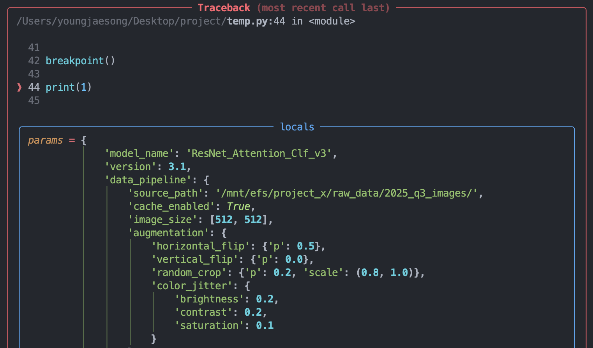
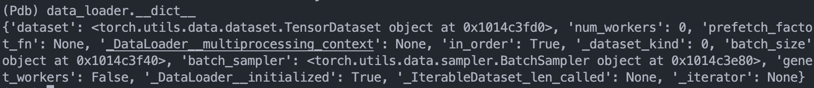
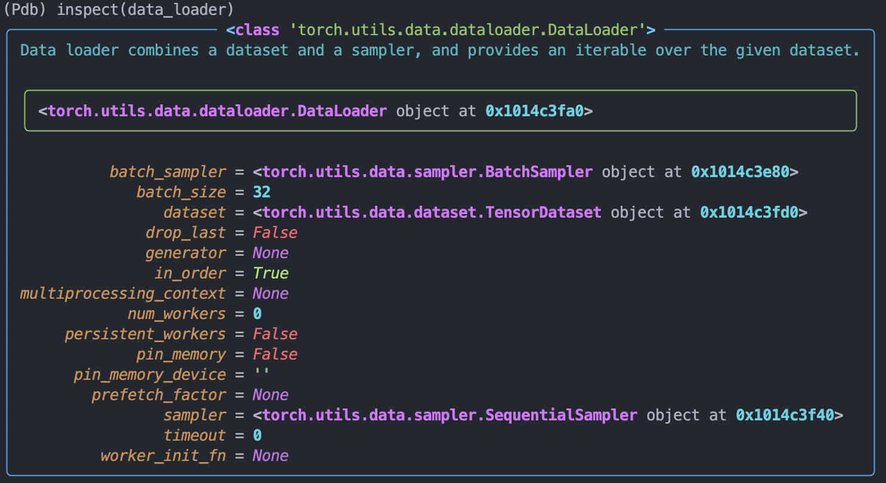

## 불친절한 pdb 출력
파이썬 개발 도중 breakpoint()를 통해 디버깅을 하는 경우, 원하는 데이터나 객체 등을 출력하면 들여쓰기도 없고, 색깔도 없이 그냥 모든 정보를 텍스트로 나열한 것만 아래 처럼 출력된다. 



python rich 라이브러리로 breakpoint()로 pdb 터미널에서 디버깅할 때 눈이 편하고 생산성이 올라가도록 셋팅해보자!

## python rich 라이브러리
1. 설치
```python
pip install rich
```

2. 셋팅
`~/.pdbrc` 파일에 아래처럼 파이썬 스크립트를 작성합니다.

```python
import rich
from rich import print as rprint
from rich.pretty import install as RPrettyInstall
from rich.traceback import install as RTracebackInstall

RTracebackInstall(show_locals=True)
RPrettyInstall()
```
`~/.pdbrc`에 위처럼 작성해두면, pdb에 진입했을 때 자동으로 해당 스크립트가 실행되어, rich 기능을 pdb 터미널 상에서 사용할 수 있습니다. 위와 동일하게 pdb 상에서 `rprint`로데이터를 출력해보면 들여쓰기와 데이터 색깔로 데이터 타입까지 한 눈에 알아볼 수 있게 출력해줍니다.



심지어 Traceback까지 시각적으로 가독성이 높은 형태로 출력해줍니다.



3. `rich.inspect` 로 객체 출력 가독성 높이기

내가 사용 중인 torch dataloader가 있다고 가정했을 때, 디버깅 시 해당 dataloader 객체를 뒤져보고 싶은 경우, 일반적으로 아래처럼`data_loader.__dict__`를 사용할 수 있습니다.



여기서 `rich.inspect`를 사용하면 아래처럼 docstring에 작성된 해당 객체의 설명과 객체에 해당 프로퍼티 등을 모두 뜯어볼 수 있습니다.



## 마무리
`rich`는 단순히 터미널 출력을 예쁘게 꾸미는 라이브러리가 아니라, 코드와 데이터의 '상태'를 명확하게 인지시켜 디버깅 시간을 단축하고, 개발자의 인지 부하를 줄여주는 강력한 생산성 도구입니다.
