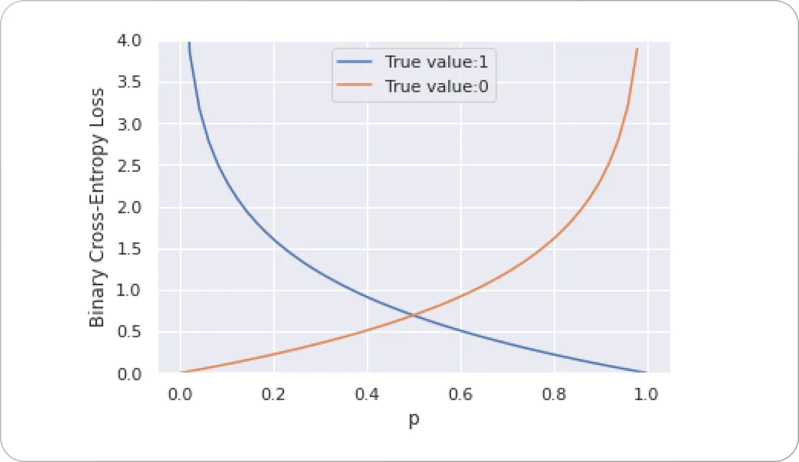

ML 모델을 학습할 때 분류 문제라면 accuracy를 모델 성능을 평가하는 타겟 지표 중 하나로 사용합니다.
여기서, 목표가 accuracy를 높이는 것이라면, `-accuracy`로 loss function을 설정하면 되지 않나? 하는 질문이 생길 수 있습니다. 이 글에서는 왜 accuracy가 gradient decent의 loss function이 될 수 없는지 이야기해보겠습니다.

## 1. loss function은 미분 가능 해야한다.
ML 모델 학습은 기본적으로 **최적화 문제**입니다. 모델의 예측과 실제 정답 사이의 `오차`를 최소화하는 **방향**으로 모델의 가중치를 업데이트하는 과정이죠. 이때 **오차**를 수치화하는 함수가 바로 loss function이 됩니다. 
오차를 최소화하도록 최적화를 하려면, 오차가 줄어드는 **방향**을 알아야하는데, 이는 loss function의 미분값을 알아야 합니다. 다시 말해, ML 모델을 gradient decent로 학습하려면 loss function은 **미분가능**해야합니다.

$$
w_{new} = w_{old} - \lambda \frac{dL}{dw}
$$

$w$: 신경망의 가중치(파라미터)
$L$: Loss function
$\lambda$: Learning rate

Loss function이 모델 파라미터에 대해 미분 불가능하다면 애초에 gradient decent를 사용할 수가 없습니다.

## 2. CrossEntropy가 사용되는 이유
문제를 간단하게 보기 위해 이진 분류 문제에서의 CrossEntropy를 살펴봅시다.

$$
H(p) = y*log(p)+(1-y)*log(1-p)
$$

$H$: CrossEntropy
$y$: ground-truth
$p$: prediction

위 수식처럼 CrossEntropy는 미분가능한 `log`를 사용하기 때문에 미분이 가능하기 때문에 accuracy와 다르게 loss function으로 사용가능합니다.

특히 CrossEntropy의 그래프를 보면 예측이 정답과 반대되는 값을 내놓을 수록 loss의 기울기가 가파릅니다. 게다가 정답에 가까운 예측을 내놓을수록 기울기가 완만합니다. 직관적으로 이야기하면, 이미 알고 있는 내용은 덜 학습하고, 잘못 알고 있는 내용을 교정하는 방향으로 학습하도록 유도됩니다. Accuracy는 미분도 불가능한데, 이러한 behavior를 암시하지도 못 하기 때문에 미분 가능하더라도 loss function으로 부적절하다고 할 수 있습니다.
