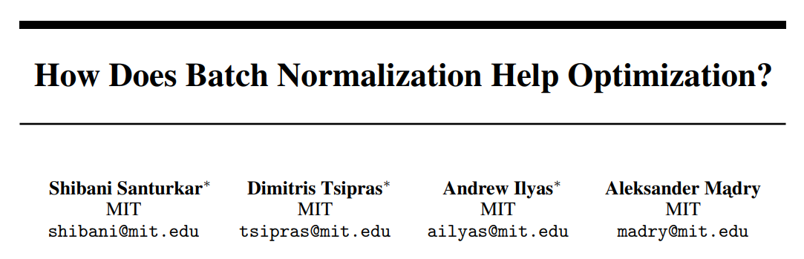

BatchNorm(Batch Normalization)은 ICS(Internal Covariate Shift)를 제거하여 gradient vanishing을 성공적으로 해결하고 깊은 NN에서도 학습을 안정화 시키는 것으로 알려져있지만 이는 사실이 아닙니다. 이 글에서는 BatchNorm이 성공적인 이유가 ICS가 아닌 다른 원인에 있음을 알아보겠습니다.

## 1. BatchNorm 동작 방식
BatchNorm을 가장 처음 제안한 논문에서는 ICS가 NN 학습 불안정의 주요 원인 중 하나이며, BatchNorm이 ICS를 줄여 이 문제를 해결한다고 주장합니다.
#### ICS란?
배치 크기가 16이라고 가정하면, NN 내부에 모든 노드들은, 총 16개의 summation값($s=\Sigma wa$)을 input으로 받게 되며 특정 분포를 형성하게 됩니다. 문제는 $w$가 업데이트될 때마다 summation의 분포가 중구난방으로 바뀌는데, 기존 논문에서는 이것이 ICS(Internal Covariate Shift)이며, NN학습 불안정의 주요 원인 중 하나로 지적합니다.

#### BatchNorm 
ICS를 줄이기 위해서 summation값들을 normalize($\hat{s}=\frac{s-\mu_s}{\sigma_s^2}$)해서 $\mathcal{N}(0,1)$ 가우시안 분포로 만듭니다. 이러면 모든 노드에서 summation값 분포가 반드시 $\mathcal{N}(0,1)$를 따르기 때문에, ICS가 발생하지 않습니다. 하지만, activation function에 들어갈 때 모두 relu는 항상 $s$의 절반을 0으로 보내고, sigmoid는 선형성이 지배적인 0 근처의 값만 선형적으로 내뱉게 되니, 뭔가 비선형성이라던지 표현력을 잃어버리는 문제가 발생합니다. 기존 논문 저자는 이 문제를 해결하기 위해 trainable parameter인 $\gamma$와 $\beta$를 노드 별로 도입합니다.

$$
\tilde{s}=\gamma\hat{s}+\beta
$$

학습이 이루어 지는 동안에 $w$처럼 $\gamma$와 $\beta$도 최적의 값으로 학습됩니다.

## 2. BatchNorm이 성공적인 진짜 이유
#### BatchNorm은 ICS를 제거하지 않는다.
$\tilde{s}=\gamma\hat{s}+\beta$ 식을 살펴보면, 기껏 $\hat{s} \sim \mathcal{N}(0,1)$로 만들어 놨더니만, 다시 $\tilde{s} \sim \mathcal{N}(\beta,\gamma)$로 만들어놓은 셈이 된다. $s$의 분포가 업데이트 되는 $w$에 의해 변경되기 때문에 ICS가 발생한다고 했는데, $\gamma$와 $\beta$도 trainable parameter이므로, $\tilde{s}$ 분포 역시 학습 도중 변합니다. 따라서, BatchNorm이 ICS를 제거한다고 말할 수 없습니다.. 

#### ICS는 학습 불안정의 요인이 아니다.
<a href='https://arxiv.org/pdf/1805.11604'>해당 논문</a>에서는 ICS가 정말 학습 불안정의 요소인지 확인하기 위해서 BatchNorm을 적용한 후에 의도적으로 noise를 주입해 매번 활성화 분포를 강제로 뒤바꿔 ICS를 인위적으로 극대화하는 실험을 수행했습니다. 실험 결과, ICS를 발생시키기 않았을 때와 수렴속도와 성능은 거의 동일한 것을 발견합니다. 이 실험은 학습 불안정이 ICS 유무와는 관련이 없음을 시사합니다.

#### 그렇다면 BatchNorm은 왜 학습을 안정화시키나?
결론부터 말하면, **BatchNorm이 gradient와 loss의 Lipschitzness를 개선시키기 때문**입니다. 

$$
s \sim \mathcal{N}(\mu_s, \sigma_s^2) \text{  vs.  } \tilde{s} \sim \mathcal{N}(\beta, \gamma)
$$

BatchNorm 전과 후의 분포 평균과 분산을 잘 뜯어봅시다. $\mu_s$와 $\sigma_s$는 업데이트 되는 이전 layer까지의 모든 $w$와 활성함수의 영향을 받습니다. 너무나도 많은 값에 dependency를 갖기 때문에 gradient가 굉장히 들쭉날쭉(낮은 Lipchitzness)합니다. 반대로 $\tilde{s}$는 오직 단 2개의 파라미터 $\beta$와 $\gamma$에만 dependency를 가집니다. gradient의 변동폭이 비교적 훨씬 낮을 것임(높은 Lipchitzness)을 직관적으로 알 수 있습니다. 수학적으로 증명한 내용은 <a href='https://arxiv.org/pdf/1805.11604'>해당 논문</a>에서 찾을 수 있습니다.
이에 따라, 자연스레 loss landscape 역시 들쭉날쭉하지 않고 비교적 smooth하게 평탄화된 모습을 띄게 되어 학습이 안정화 됩니다.

## 3. 결론
기존 논문에서는 학습 불안정의 요인이라고 가정한 ICS를 줄이기 위해 BatchNorm을 제안했습니다. 하지만 실제로는 ICS는 딱히 학습 불안정의 요인도 아니었고, BatchNorm이 ICS를 제거하지도 않았습니다. BatchNorm이 노드별 summation의 분포를 단 2개의 trainable parameter에만 의존하게 만듦으로써 gradient와 loss를 비교적 smooth하게(높은 Lipschiztzness) 만들었기 때문에 학습이 안정화되는 것입니다.
결과적으로, BatchNorm은 깊은 신경망에서 gradient vanishing같은 문제를 해결하고, 학습 수렴속도 및 모델 성능을 개선하는 역할을 하게 됩니다.
